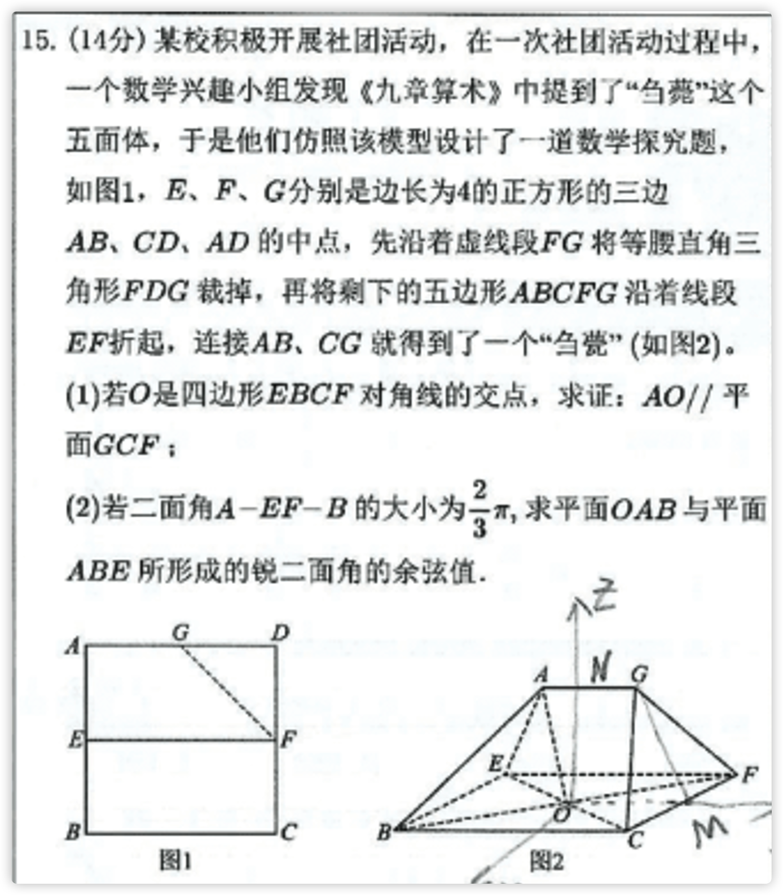

# MathLens — AI Math Teaching Video Generator

> Turn a math problem into a narrated, animated teaching video.

MathLens is a **Cursor Agent Skill**. Just paste a math problem (image or text), and it automatically handles the full pipeline: problem analysis → visual explanation → voiceover scripting → Manim animation video.

---

## Demo

### Input: A math problem screenshot



### Output: Narrated Manim animation

<video src="resource/output.mp4" controls width="100%"></video>

> If the video doesn't preview, download [output.mp4](resource/output.mp4) directly.

---

## Highlights

- **Fully automated pipeline**: 8-step workflow from image to video, no manual glue needed
- **Student-friendly explanations**: AI tutors step-by-step like a 1-on-1 teacher
- **SVG visual explanations**: Auto-generates annotated HTML documents for instant preview
- **Natural-sounding voiceover**: Powered by edge-tts with selectable voices (default: Xiaoxiao)
- **Frame-accurate audio sync**: `wait_for_narration(keyword)` triggers animations exactly when the narration says the keyword
- **Geometry self-validation**: Built-in `assert_geometry()` verifies coordinates to prevent incorrect diagrams
- **Professional Manim video output**: Renders polished math teaching videos

---

## Core Workflow

```
Problem Input
  │
  ▼
① Math Analysis   →  Derive facts, build geometric model
  │
  ▼
② HTML Visual     →  SVG diagram + step annotations
  │
  ▼
③ Storyboard      →  Define scenes, design visuals / subtitles / narration
  │
  ▼
④ TTS Audio       →  Generate per-scene .wav + sync point index
  │
  ▼
⑤ Audio Validate  →  Verify durations, write back to storyboard
  │
  ▼
⑥ Scaffold        →  Generate Manim framework (geometry + scene structure)
  │
  ▼
⑦ Animation Code  →  Implement scene-by-scene, aligned to narration sync points
  │
  ▼
⑧ Render & Check  →  Output video + keyframes; auto-retry on failure
```

---

## Quick Start

### Prerequisites

```bash
pip install uv manim edge-tts
```

### Initialize a project

```bash
python init.py ./my_math_problem
```

### Trigger the Skill

In Cursor, paste a problem image or description:

```
(paste math problem screenshot)

Please explain this problem and generate a teaching video.
```

The AI will automatically run the full 8-step pipeline.

---

## Run Scripts Manually

```bash
# Generate TTS audio
python scripts/generate_tts.py audio_list.csv ./audio --voice xiaoxiao

# Validate audio and write durations back to storyboard
python scripts/validate_audio.py storyboard.md ./audio

# Check Manim code structure
python scripts/check.py

# Render video
python scripts/render.py
```

---

## License

This project is licensed under **CC BY-NC 4.0 (Attribution-NonCommercial 4.0 International)**.

- **Personal / educational use**: Free to use and share
- **Commercial use**: Requires written permission from the author

> [Creative Commons Attribution-NonCommercial 4.0 International](https://creativecommons.org/licenses/by-nc/4.0/)
